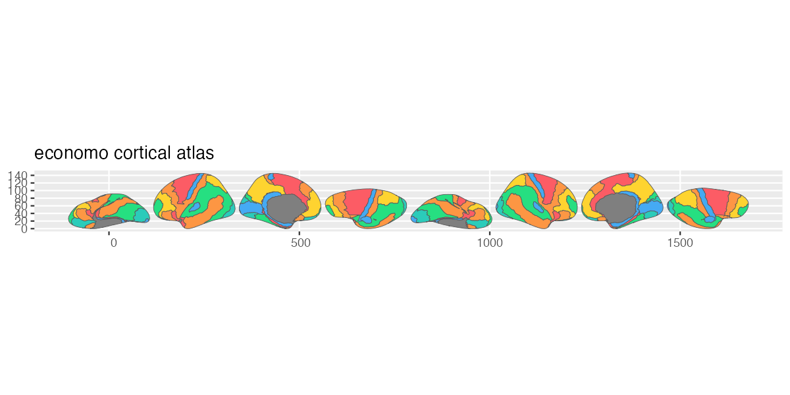

# ggsegEconomo

<!-- badges: start -->
[](https://github.com/ggsegverse/ggsegEconomo/actions/workflows/R-CMD-check.yaml)
[](https://ggsegverse.r-universe.dev/ggsegEconomo)
<!-- badges: end -->

Economo Atlas for the ggsegverse Ecosystem.

## Installation

``` r
# From r-universe
install.packages("ggsegEconomo", repos = "https://ggsegverse.r-universe.dev")

# From GitHub
# install.packages("remotes")
remotes::install_github("ggsegverse/ggsegEconomo")
```

## Usage

``` r
library(ggsegEconomo)
library(ggseg)

plot(economo()) +
  theme_brain()
```

## Atlas

### economo

Economo & Koskinas 1925 cytoarchitectonic parcellation with 15 regions per hemisphere (Pijnenburg et al., 2021).



## Data source

Annotation files from the supplementary materials of Pijnenburg et al. (2021), projected onto fsaverage5.

- **Reference**: Economo & Koskinas (1925); Pijnenburg et al. (2021) [doi:10.1016/j.neuroimage.2021.118274](https://doi.org/10.1016/j.neuroimage.2021.118274)
- **Date obtained**: 2021-11-05
