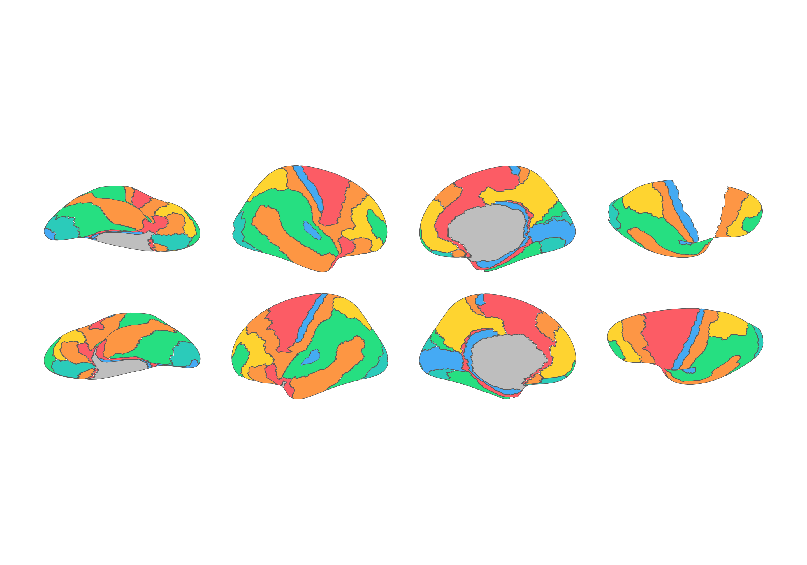

# ggsegEconomo

This package contains the Economo & Koskinas 1925 historical
cytoarchitectonic atlas for plotting with ggseg and ggseg3d, based on
the supplementary materials of Pijnenburg et al., NeuroImage, 239, 2021
[DOI](https://doi.org/10.1016/j.neuroimage.2021.118274).

C.F. von Economo, G.N. Koskinas; Die Cytoarchitektonik Der Hirnrinde Des
Erwachsenen Menschen; J. Springer (1925)

To learn how to use these atlases, please look at the documentation for
[ggseg](https://ggsegverse.github.io/ggseg/) and
[ggseg3d](https://ggsegverse.github.io/ggseg3d)

## Installation

You can install ggsegEconomo from [GitHub](https://github.com/) with:

``` r
# install.packages("remotes")
remotes::install_github("ggsegverse/ggsegEconomo")
```

## Plot

``` r
library(ggsegEconomo)
library(ggseg)
library(ggplot2)

ggplot() +
  geom_brain(
    atlas = economo(),
    mapping = aes(fill = label),
    position = position_brain(hemi ~ view),
    show.legend = FALSE
  ) +
  scale_fill_manual(values = economo()$palette, na.value = "grey") +
  theme_void()
```



``` r
library(ggseg3d)

ggseg3d(atlas = economo()) |>
  pan_camera("right lateral")
```

Please note that the ‘ggsegEconomo’ project is released with a
[Contributor Code of
Conduct](https://ggsegverse.github.io/ggsegEconomo/CODE_OF_CONDUCT.md).
By contributing to this project, you agree to abide by its terms.
